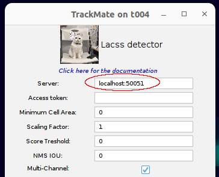

# TrackMate-Lacss

A plugin of a plugin. 

This software adds a new cell detector to [TrackMate](https://imagej.net/plugins/trackmate/index), an interactive cell/object tracker of [FIJI/ImageJ](https://imagej.net/software/fiji/). The detector connect to a (remote) [BioPB server](https://github.com/biopb/biopb) to find and segment cells.


## How does it work

This simple Java plugin communicates with the a BioPB server of your choice using [gRPC](https://grpc.io/) protcol. The pixel data are sent via internet. The computation is done on the server side. You can obtained results quickly even if you are on a low-end computer without GPU.

## Installation

Install Trackmate-Lacss plugin via Fiji's the built-in updater, i.e. ```Help/Update/Manage update sites```.

|  |  |


## Usage
Start TrackMate in Fiji (`Plugins/Tracking/TrackMate`). At the detector selection page, select "Lacss detector" from the dropdown menu.


## Use outside TrackMate

Not doing cell tracking? You can use this [example script](https://github.com/biopb/trackmate-lacss/blob/main/scripts/Lacss_.py) to perform a segmentation on current open image.

## (Optional) Run your own server

By default, trackmate-lacss will try to connect to the public server remotely. However, you can also easily setup your own server, which allows for faster reponse and better data security.

### Requirement
 - A linux system with an NVidia GPU.
 - Docker

**Step 1:**
``` sh
docker run --gpus=all p 50051:50051 jiyuuchc/lacss --local
```

*See [biopb](https://github.com/biopb/biopb/tree/main/docker) project for more details*

**Step 2:** 

Run FIJI/Trackmate as usual. At tha Lacss configuration page, provide the correct server address.



